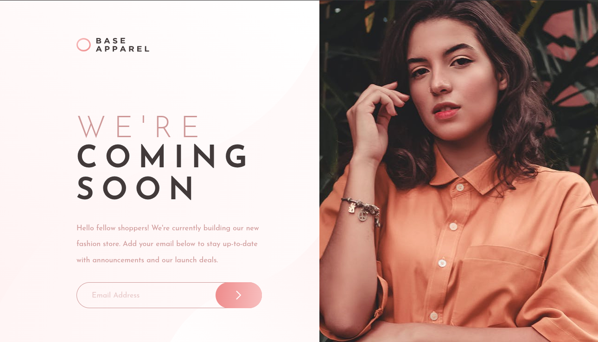
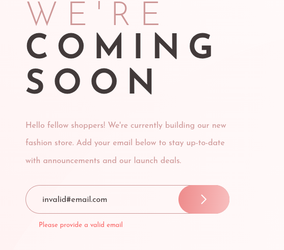

# Frontend Mentor - Base Apparel coming soon page solution

This is a solution to the [Base Apparel coming soon page challenge on Frontend Mentor](https://www.frontendmentor.io/challenges/base-apparel-coming-soon-page-5d46b47f8db8a7063f9331a0). Frontend Mentor challenges help you improve your coding skills by building realistic projects.

## Table of contents

- [Overview](#overview)
  - [The challenge](#the-challenge)
  - [Screenshot](#screenshot)
  - [Links](#links)
- [My process](#my-process)
  - [Built with](#built-with)
  - [What I learned](#what-i-learned)
  - [AI Collaboration](#ai-collaboration)
- [Author](#author)

## Overview

### The challenge

Users should be able to:

- View the optimal layout for the site depending on their device's screen size
- See hover states for all interactive elements on the page
- Receive an error message when the `form` is submitted if:
  - The `input` field is empty
  - The email address is not formatted correctly

### Screenshot

### Links

- Solution URL: [Add solution URL here](https://your-solution-url.com)
- Live Site URL: [Add live site URL here](https://your-live-site-url.com)

## My process

### Built with

- create-elm-app
- elm-ui

### What I learned

- Switching mental model from css to elm-ui
- elm-ui Input.text (v1.1.8) is using opacity (alpha) to hide the placeholder onFocus. Therefore, if we add style to set the placeholder's opacity (example: alpha 0.5), the placeholder will not hidden when we typed on the text input. Workaround -> Use rgba for the text color to set placeholder text opacity.

### AI Collaboration

I use free DeepSeek chat to troubleshoot and asks for it's opinion on my code. No code copy pasted from AI chat results.

## Author

- Website - [Rinaldi Adrian](https://www.rinaldi-adrian.netlify.app)
- Frontend Mentor - [@rinarudhei](https://www.frontendmentor.io/profile/rinarudhei)
